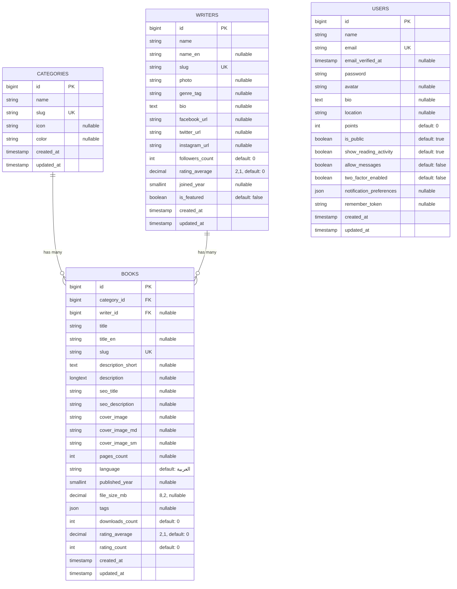

# Database Structure

This document describes the database schema for the نوته بوك (Nootabook) reader app, as defined by the migrations in [`database/migrations`](database/migrations).

## Entity-Relationship Diagram

> `USERS` currently has no foreign-key relationship to `BOOKS`/`CATEGORIES` — there is no favorites/library/reviews pivot table yet.

## Tables

### `categories`

Book genres/categories shown on the Categories page.

| Column       | Type              | Notes                     |
|--------------|-------------------|----------------------------|
| `id`         | bigint, unsigned  | Primary key                |
| `name`       | string            |                             |
| `slug`       | string            | Unique                     |
| `icon`       | string, nullable  | Font Awesome class         |
| `color`      | string, nullable  | Theme color key (e.g. `cat-purple`) |
| `created_at` | timestamp         |                             |
| `updated_at` | timestamp         |                             |

**Migration:** [`2026_09_08_000001_create_categories_table.php`](database/migrations/2026_09_08_000001_create_categories_table.php)

### `writers`

Authors shown on the Writers / Writer Details pages.

| Column             | Type                        | Notes                          |
|--------------------|------------------------------|----------------------------------|
| `id`               | bigint, unsigned            | Primary key                      |
| `name`             | string                       |                                   |
| `name_en`          | string, nullable             | English name                     |
| `slug`             | string                       | Unique                           |
| `photo`            | string, nullable             | Path/URL                         |
| `genre_tag`        | string, nullable             | Short genre label (e.g. `إثارة وغموض`) |
| `bio`              | text, nullable                |                                   |
| `facebook_url`     | string, nullable              | Optional social link             |
| `twitter_url`      | string, nullable              | Optional social link (X/Twitter) |
| `instagram_url`    | string, nullable              | Optional social link             |
| `followers_count`  | int, unsigned                 | Default `0`                      |
| `rating_average`   | decimal(2,1)                  | Default `0`                      |
| `joined_year`      | smallint, unsigned, nullable  |                                   |
| `is_featured`      | boolean                       | Default `false` — "مؤلف الأسبوع" |
| `created_at`       | timestamp                     |                                   |
| `updated_at`       | timestamp                     |                                   |

**Migrations:**
[`2026_09_08_000004_create_writers_table.php`](database/migrations/2026_09_08_000004_create_writers_table.php),
[`2026_09_14_000001_add_english_name_fields_to_writers_and_books_table.php`](database/migrations/2026_09_14_000001_add_english_name_fields_to_writers_and_books_table.php) (adds `name_en`),
[`2026_09_14_000002_add_social_links_to_writers_table.php`](database/migrations/2026_09_14_000002_add_social_links_to_writers_table.php) (adds `facebook_url`, `twitter_url`, `instagram_url`)

### `books`

| Column               | Type                       | Notes                                   |
|----------------------|----------------------------|-------------------------------------------|
| `id`                 | bigint, unsigned           | Primary key                                |
| `category_id`        | bigint, unsigned, FK       | References `categories.id`, cascade on delete |
| `writer_id`          | bigint, unsigned, FK, nullable | References `writers.id`, null on delete |
| `title`               | string                     |                                             |
| `title_en`            | string, nullable           | English title                              |
| `slug`                | string                     | Unique                                     |
| `description_short`   | text, nullable             |                                             |
| `description`         | longtext, nullable         |                                             |
| `seo_title`           | string, nullable           | Manual `<title>` override; falls back to `Book::resolved_seo_title` when empty |
| `seo_description`     | string(500), nullable      | Manual meta description override; falls back to `Book::resolved_seo_description` when empty |
| `cover_image`         | string, nullable           | Path/URL — large cover, uploaded independently per size (see `Admin\BookController::storeCoverVariant()`) |
| `cover_image_md`      | string, nullable           | Path/URL — medium cover; falls back to `cover_image` when not set |
| `cover_image_sm`      | string, nullable           | Path/URL — small cover; falls back to `cover_image` when not set |
| `pages_count`         | int, unsigned, nullable    |                                             |
| `language`            | string                     | Default `'العربية'`                        |
| `published_year`      | smallint, unsigned, nullable |                                          |
| `file_size_mb`        | decimal(8,2), nullable     |                                             |
| `tags`                | json, nullable               | e.g. `["إثارة", "غموض"]`                    |
| `downloads_count`     | int, unsigned              | Default `0`                                |
| `rating_average`      | decimal(2,1)                | Default `0`                                |
| `rating_count`        | int, unsigned               | Default `0`                                |
| `created_at`           | timestamp                  |                                             |
| `updated_at`           | timestamp                  |                                             |

**Migrations:**
[`2026_09_08_000002_create_books_table.php`](database/migrations/2026_09_08_000002_create_books_table.php),
[`2026_09_08_000005_add_writer_id_to_books_table.php`](database/migrations/2026_09_08_000005_add_writer_id_to_books_table.php) (adds `writer_id`, drops the old `author_name` string column),
[`2026_09_14_000001_add_english_name_fields_to_writers_and_books_table.php`](database/migrations/2026_09_14_000001_add_english_name_fields_to_writers_and_books_table.php) (adds `title_en`),
[`2026_09_14_000003_drop_formats_from_books_table.php`](database/migrations/2026_09_14_000003_drop_formats_from_books_table.php) (drops `formats` — every book is a PDF, the format multi-select added no value),
[`2026_09_14_000004_add_seo_fields_to_books_table.php`](database/migrations/2026_09_14_000004_add_seo_fields_to_books_table.php) (adds `seo_title`, `seo_description`)

### `users`

Base Laravel `users` table, extended with reader-profile fields.

| Column                       | Type                     | Notes                                    | Added by |
|-------------------------------|--------------------------|---------------------------------------------|----------|
| `id`                          | bigint, unsigned          | Primary key                                  | base |
| `name`                        | string                    |                                               | base |
| `email`                       | string                    | Unique                                       | base |
| `email_verified_at`           | timestamp, nullable       |                                               | base |
| `password`                    | string                    | Hashed                                       | base |
| `avatar`                      | string, nullable          | Profile photo path/URL                       | profile fields migration |
| `bio`                         | text, nullable            |                                               | profile fields migration |
| `location`                    | string, nullable          |                                               | profile fields migration |
| `points`                      | int, unsigned              | Default `0`                                  | profile fields migration |
| `is_public`                    | boolean                   | Default `true` — public profile toggle       | profile fields migration |
| `show_reading_activity`       | boolean                   | Default `true`                               | profile fields migration |
| `allow_messages`              | boolean                   | Default `false`                              | profile fields migration |
| `two_factor_enabled`          | boolean                   | Default `false`                              | profile fields migration |
| `notification_preferences`    | json, nullable             | Notification toggle settings                 | profile fields migration |
| `remember_token`              | string, nullable          |                                               | base |
| `created_at`                   | timestamp                 |                                               | base |
| `updated_at`                   | timestamp                 |                                               | base |

**Migrations:**
[`0001_01_01_000000_create_users_table.php`](database/migrations/0001_01_01_000000_create_users_table.php),
[`2026_09_08_000003_add_profile_fields_to_users_table.php`](database/migrations/2026_09_08_000003_add_profile_fields_to_users_table.php)

### `password_reset_tokens`

| Column       | Type      | Notes      |
|--------------|-----------|------------|
| `email`      | string    | Primary key |
| `token`      | string    |            |
| `created_at` | timestamp, nullable |  |

### `sessions`

| Column          | Type                    | Notes             |
|-----------------|-------------------------|--------------------|
| `id`            | string                  | Primary key        |
| `user_id`       | bigint, unsigned, nullable | Indexed, FK-like ref to `users.id` |
| `ip_address`    | string(45), nullable    |                    |
| `user_agent`    | text, nullable          |                    |
| `payload`       | longtext                |                    |
| `last_activity` | int                     | Indexed            |

### System / queue tables

Standard Laravel infrastructure tables — not part of the app's domain model:

| Table          | Purpose                          |
|----------------|-----------------------------------|
| `cache`        | Cache driver storage (key/value)  |
| `cache_locks`  | Atomic lock storage for cache     |
| `jobs`         | Queued job storage                |
| `job_batches`  | Batched job tracking              |
| `failed_jobs`  | Failed queue job storage          |

## Eloquent Models & Relationships

| Model | Table | Relationships |
|-------|-------|----------------|
| [`App\Models\Category`](app/Models/Category.php) | `categories` | `books()` → `hasMany(Book::class)` |
| [`App\Models\Writer`](app/Models/Writer.php)     | `writers`    | `books()` → `hasMany(Book::class)` |
| [`App\Models\Book`](app/Models/Book.php)         | `books`      | `category()` → `belongsTo(Category::class)`, `writer()` → `belongsTo(Writer::class)` |
| [`App\Models\User`](app/Models/User.php)         | `users`      | *(none yet — no favorites/library/review pivot exists)* |

`Book.tags` and `User.notification_preferences` are cast to PHP arrays (`array` cast); `Book.file_size_mb`, `Book.rating_average`, and `Writer.rating_average` are cast to `decimal`; the boolean profile-preference columns on `User` and `Writer.is_featured` are cast to `boolean`.
